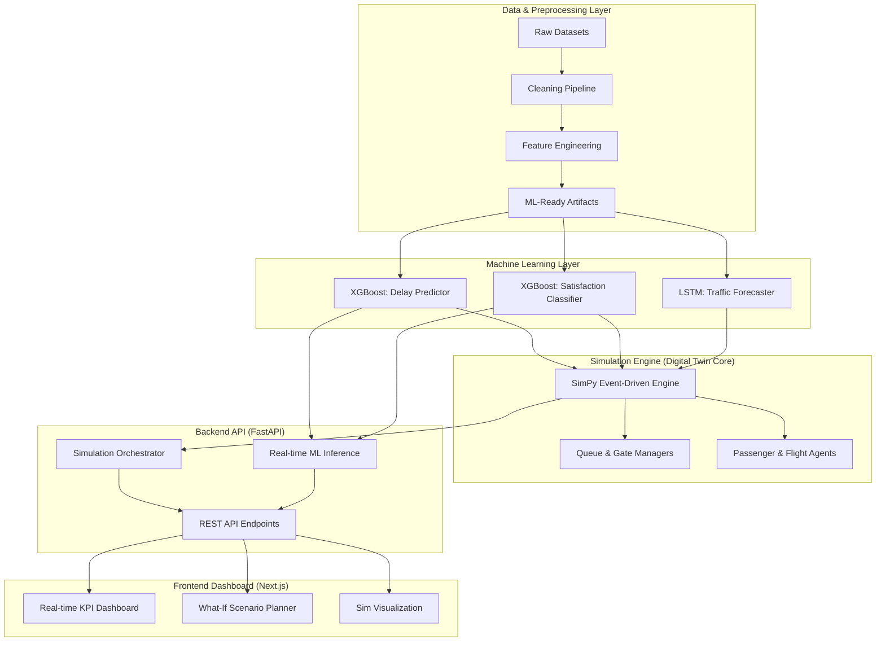

# ✈️ AI Airport Operations Digital Twin System

[](https://www.python.org/)
[](https://fastapi.tiangolo.com/)
[](https://nextjs.org/)
[]()

A production-grade **Digital Twin** designed to simulate, predict, and optimize airport operations. By integrating **Discrete Event Simulation (SimPy)** with **Deep Learning (LSTM)** and **Gradient Boosting (XGBoost)**, the system enables airport operators to conduct "What-If" analysis on infrastructure changes and passenger load surges.

---

## 🏗️ System Architecture

The system follows a modular, N-tier architecture designed for scalability and real-time state synchronization.



---

## 🧠 ML Model Specifications

### 1. Flight Delay Prediction (XGBoost)
- **Task:** Regression (Predicting `ARRIVAL_DELAY` in minutes).
- **Key Features:** `congestion_score`, `rush_hour`, `TAXI_OUT`, `is_weekend`.
- **Role:** Injects realistic perturbations into the simulation timeline.

### 2. Passenger Satisfaction (XGBoost)
- **Task:** Binary Classification (Satisfied vs. Dissatisfied).
- **Key Features:** `customer_tolerance_index`, `service_quality_score`, `Age`, `Class`.
- **Role:** Models agent sentiment based on real-time wait times in simulation queues.

### 3. Traffic Forecasting (LSTM)
- **Task:** Time-Series Forecasting (Predicting monthly passenger counts).
- **Architecture:** Multi-layer LSTM with Dropout for overfit prevention.
- **Role:** Drives the "Master Load" generation for the simulation engine.

---

## 🛠️ Tech Stack

- **Core:** Python 3.9+, TypeScript
- **ML/AI:** XGBoost, TensorFlow/Keras, Scikit-learn, Pandas, NumPy
- **Simulation:** SimPy (Discrete Event Simulation)
- **Backend:** FastAPI, Uvicorn, Pydantic, Joblib
- **Frontend:** Next.js (App Router), TailwindCSS, Recharts, Lucide-React

---

## 📂 Project Structure

```bash
AI-Airport-Digital-Twin/
├── backend_fastapi/        # REST API Layer
│   ├── routes/             # API Endpoints (ML, Sim, What-If)
│   ├── services/           # Business Logic (Model & Sim Orchestration)
│   └── schemas/            # Pydantic Data Contracts
├── ml_models/              # Machine Learning Suite
│   ├── saved_models/       # Persistent Model Artifacts (.pkl, .h5)
│   └── train_*.py          # Model Training Pipelines
├── simulation/             # Discrete Event Simulation Core
│   ├── engine/             # SimRunner & Clock Management
│   ├── entities/           # Flight & Passenger Agents
│   └── services/           # Queue & Gate Resource Managers
├── preprocessing/          # Data Engineering Pipeline
│   ├── clean_*.py          # Dataset Specific Cleaning
│   ├── feature_eng.py      # Simulation-focused Feature Synthesis
│   └── build_final.py      # Final ML-Ready Data Assembly
├── datasets/               # Raw and Processed CSVs
├── frontend_nextjs/        # Next.js Dashboard UI
└── requirements.txt        # Full Project Dependencies
```

---

## 🚀 Setup & Installation

### 1. Environment Configuration
```bash
# Clone the repository
git clone https://github.com/your-repo/ai-airport-twin.git
cd ai-airport-twin

# Create virtual environment
python -m venv venv
source venv/bin/scripts/activate  # Windows: venv\Scripts\activate

# Install dependencies
pip install -r requirements.txt
```

### 2. Data Pipeline Execution
Must be run sequentially to build the Digital Twin's data lake:
```bash
python preprocessing/clean_dataset_1.py
python preprocessing/clean_dataset_2.py
python preprocessing/clean_dataset_3.py
python preprocessing/feature_engineering.py
python preprocessing/build_final_datasets.py
```

### 3. Model Training
```bash
python ml_models/train_delay_model.py
python ml_models/train_satisfaction_model.py
python ml_models/train_traffic_model.py
```

### 4. Running the System
```bash
# Terminal 1: Start Backend
.venv\Scripts\activate 
uvicorn backend_fastapi.main:app --reload

# Terminal 2: Start Frontend
cd frontend_nextjs
npm install
npm run dev
```

---

## 📈 What-If Scenario Analysis

The system allows you to manipulate real-world constraints via the dashboard:

- **Resource Optimization:** Reduce `security_counters` from 5 to 2 to observe the impact on wait times and passenger churn.
- **Demand Stress Test:** Increase `increase_flights_percent` by 30% to see where the airport bottlenecks first.
- **Operational Resilience:** Add a `delay_offset_minutes` to simulate a global weather event and watch how AI predicts the drop in overall satisfaction scores.

---

## 🖼️ Screenshots (Simulated Previews)

### 1. Executive KPI Dashboard
*(A clean overview of active flights, average delay, and satisfaction trends)*
> **[IMAGE_PLACEHOLDER: dashboard_view.png]**

### 2. Live Simulation Visualizer
*(Real-time passenger flow monitoring from Arrival to Boarding)*
> **[IMAGE_PLACEHOLDER: simulation_flow.png]**

### 3. What-If Scenario Comparison
*(Side-by-side results showing the impact of reducing security staff)*
> **[IMAGE_PLACEHOLDER: what_if_analysis.png]**

---

## 👨‍💻 Engineering Standards

This project adheres to **Industry-grade AI/ML standards**:
- **Clean Architecture:** Separation of Concerns (Entities, Services, Routes).
- **Data Contracts:** Strict Pydantic schemas for API integrity.
- **Production-Ready ML:** Automated logging, persistence, and feature scaling.
- **Modular Simulation:** Object-oriented agents for high-fidelity modeling.
